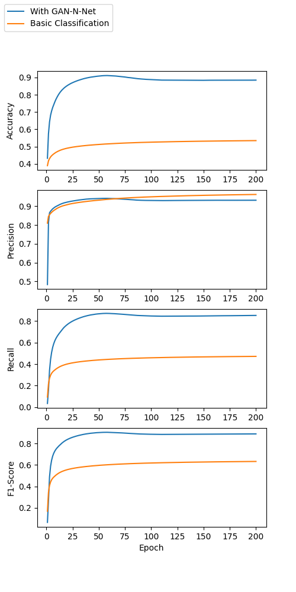
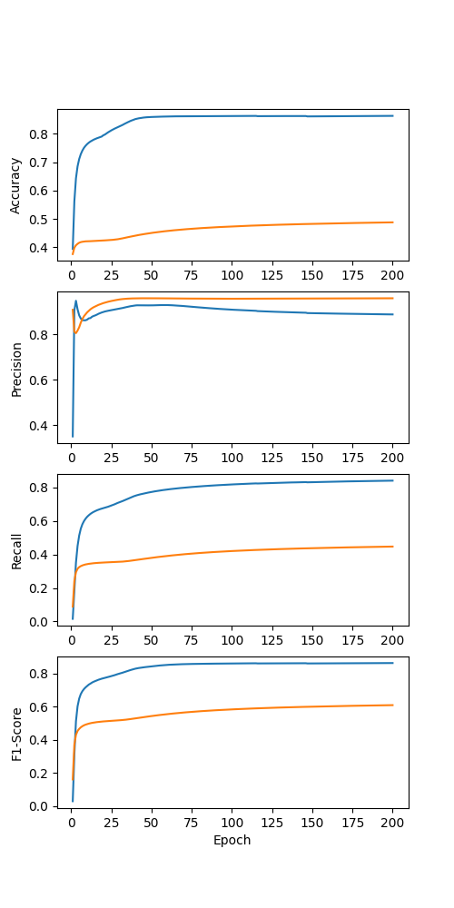
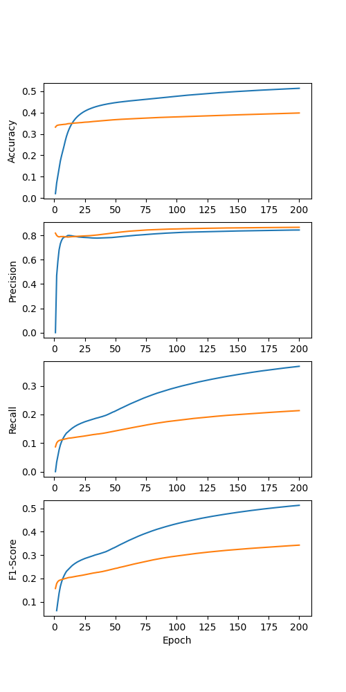
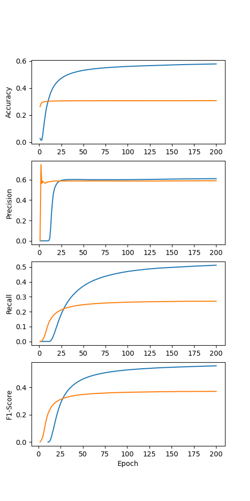

# GAN-N-Net Project README

## Overview

The GAN-N-Net repo contains code written as part of my research to provide a method for reproducing the results presented in the associated paper. The codebase includes implementation of models with and without the proposed GAN-N-Net model enhancements.

## Performance Visualizations
The following graphs show the Validation set convergence accuracy, precision, recall, and F1-score for each dataset:

<div align="center">
    
    
    
    
</div>

<div align="center">
    <em>Validation set convergence accuracy, precision, recall, and F1-score for each dataset</em>
</div>

Due to space constraints in the paper, we presented convergence results for only two datasets. Here, we provide the complete convergence visualizations for all datasets used in our research.

## Repository Structure

- `mini.py`: Script to obtain results using our GAN-N-Net model.
- `mini100.py`: Script to obtain results without using our GAN-N-Net model.

## Getting Started

To reproduce the paper results, follow these steps:

### Prerequisites

Ensure you have the requairements package installed
you can use requirements.txt file
pip install -r requirements.txt

### Installation

Clone the repository to your local machine:

```bash
git clone https://github.com/ArielCyber/GAN-N-Net.git
```
```bash
cd GAN-N-Net
```
```bash
pip install -r requirements.txt
```

### To get results with our model:

for QUIC Paris-Est Créteil(quic_pcaps), run:
```bash
python mini.py GAN-N-Net/datasets/mini_flowpic_quic_pcaps 
```

for QUIC Berkeley (quic text), run:

```bash
python mini.py GAN-N-Net/datasets/mini_flowpic_quic_text
```

### To get results without our model


For QUIC Paris-Est Créteil(quic_pcaps), run:
```bash
python mini100.py GAN-N-Net/datasets/mini_flowpic_quic_pcaps 
```

For QUIC Berkeley (quic text), run:

```bash
python mini100.py GAN-N-Net/datasets/mini_flowpic_quic_text
```

You can also set a unique name for your traning.

For example:
```bash
python mini.py GAN-N-Net/datasets/mini_flowpic_quic_pcaps try_gannet
```

## This is a list of all available Arguments

mini.py & mini100.py accepts the following arguments to customize its behavior:

* **`data_dir`** (Required): The directory containing your training data. 

* **`run_name`** (Optional): A name for this specific run of the script. This name will be used in log files. If not provided, the data folder name will be used.

* **`--test_split`** (Optional): The fraction of the data to allocate for the test set (e.g., 0.2 represents 20%). Default is 0.1 (10%).

* **`--val_split`** (Optional): The fraction of the data to allocate for the validation set. Default is 0.3 (30%).

* **`--batch_size`** (Optional): The batch size used during training. Default is 64.

* **`--drop_reminder`** (Optional): Drop the last batch if it is not full. Default is True.

* **`--label_rate`** (Optional): Rate of labels in the training data. Default is 1 (all).

* **`--epochs`** (Optional): Number of epochs to train. Default is 200.

* **`--train_rate`** (Optional): Rate of training data. Default is 1 (all).

* **`--save_model`** (Optional): Save the model after training. Default is False.

**Example Usage:**

```bash
python mini.py /path/to/data/ my_training_run --test_split 0.25 
